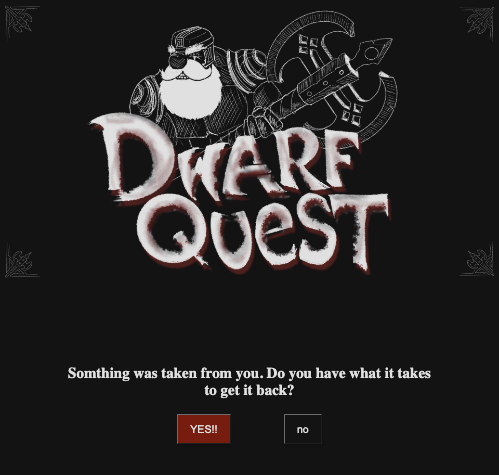

# <ins>DWARF QUEST<ins/>
Coded and illistrated by: Steven Morrison




Dive into the boots of a weary old dwarf who yearns for nothing more then to come home, kick off his boots, put on some tea, and pet his beloved cat, Méowyn. I created this game out of my passion for storytelling, world-building, and puzzle solving. In this game, you'll simply click on the desired option using the buttons below the text. Read carefully; sometimes, if you're stuck, the answer may be concealed within the text or the accompanying image.

Try it yourself here:  
**https://dwarf-quest.surge.sh/**
##

## Highlights:  

```js
function playSwordAudio() {
  let randNum = Math.floor(Math.random() * 2)
  let sounds = [playSwordAudioII, playSwordAudioIII, playSwordAudioIV]
  sounds[randNum]()
}
```
One cool function I wrote is this random sound function, which I'm particularly proud of. I hadn't completely anticipated `sounds[randNum]()` to operate as a function, but it surely did! Implementing this function significantly diversified the game sounds, breaking the monotony of the singular sword sound that previously played with each button press.
##
## Attributions:   
  - Sword Clash 2, 3, and 4: 32Cheeseman32  
    - https://freesound.org/people/32cheeseman32/sounds/180819/  
    - https://freesound.org/people/32cheeseman32/sounds/180818/  
    - https://freesound.org/people/32cheeseman32/sounds/180817/  
##
## Technologies Used:  
  - JavaScript  
  - HTML  
  - CSS  
  - Procreate  
##
## Next Steps:  
- Transition the game into a more dynamic state change system. At present, it relies on an array index to traverse various state objects. Altering the sequence of this array necessitates revisiting each state and adjusting the values in their `nextState` properties.  
- Incorporate an inventory system. Here, different `nextState` options might be accessible depending on specific item boolean conditions.  
- Embed a health tracking mechanism that monitors the player's HP throughout the gameplay. Reaching zero will transition the player to the game's conclusion.  
- With the integration of inventory and health, I aspire to introduce a turn-based battle mechanism akin to popular games like Final Fantasy or Pokémon.  
- Lastly, I wish to refine the game's sound system. While I take pride in my playSwordAudio function, I'm eager to diversify the sounds based on the game state or player choices and even some music or atmospheric effects throughout the game.